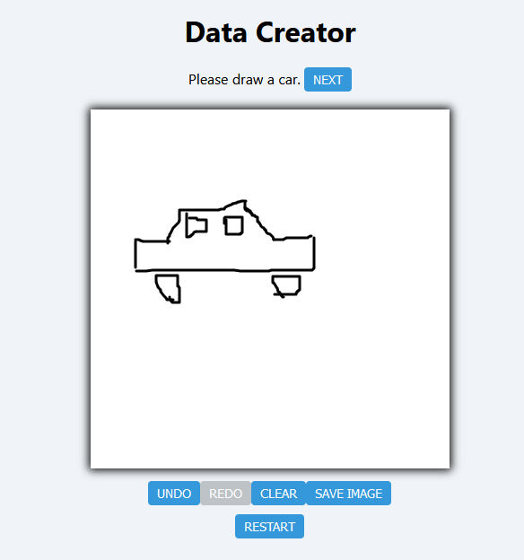
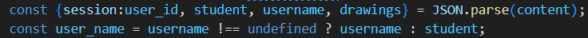
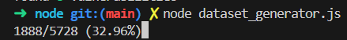

# Drawing Classifier App


This is a machine learning project to develop an image classifier that identifies images drawn with a drawing app.

## Data Creator
This is the component used to draw the images, with the entrypoint <b>creator.html</b>. Enter your name, make an attempt to draw a picture of the given object, and download the data at the end as a <b>.json</b> file, to be added to the classifier:


## Dataset Generator
This component takes a collection of data generated by the Data Creator, and changes it into a suitable format for image classification.
This makes use of the Node.js <b><a href="https://www.npmjs.com/package/canvas">canvas</a></b> package to represent the data as a <b>.png</b> file.
The data used for this project is found <b><a href="https://github.com/gniziemazity/drawing-data/tree/main/data/raw">here</a></b> <i>(Last updated: 15/05/2023)</i>. Due to compatibility issues with the data created with the Data Creator and the existing dataset, <b>dataset_generator.js</b> renames and re-orders the keys in each <b>.json</b> data file (i.e. student, username -> user_name):


To install the dependencies, ensure the current working directory is set to the <b>node</b> directory, and then run:
```bash 
npm install
```
And then ensuring that the user generated data files are in in the <b>data/raw</b> directory, run the following command to extract the data:
```bash
node dataset_generator.js
```

